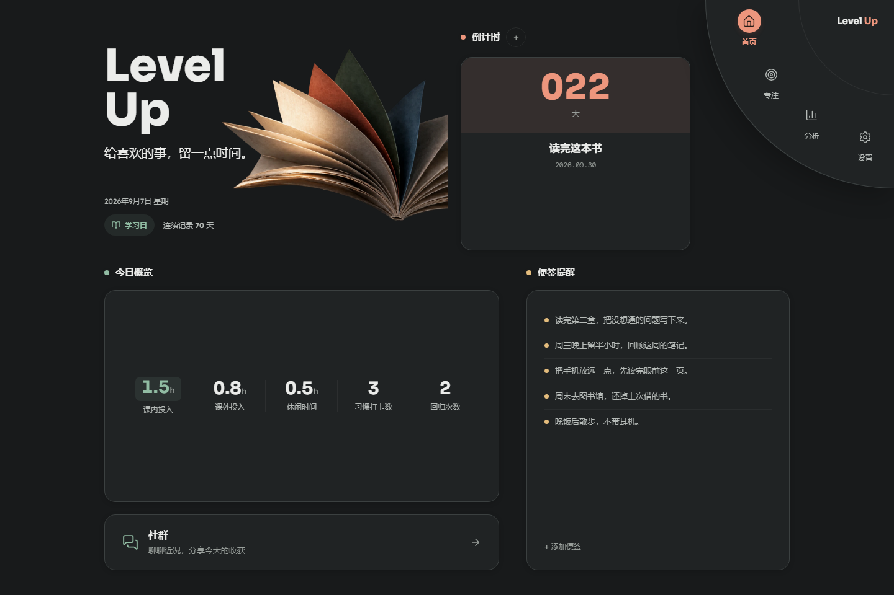
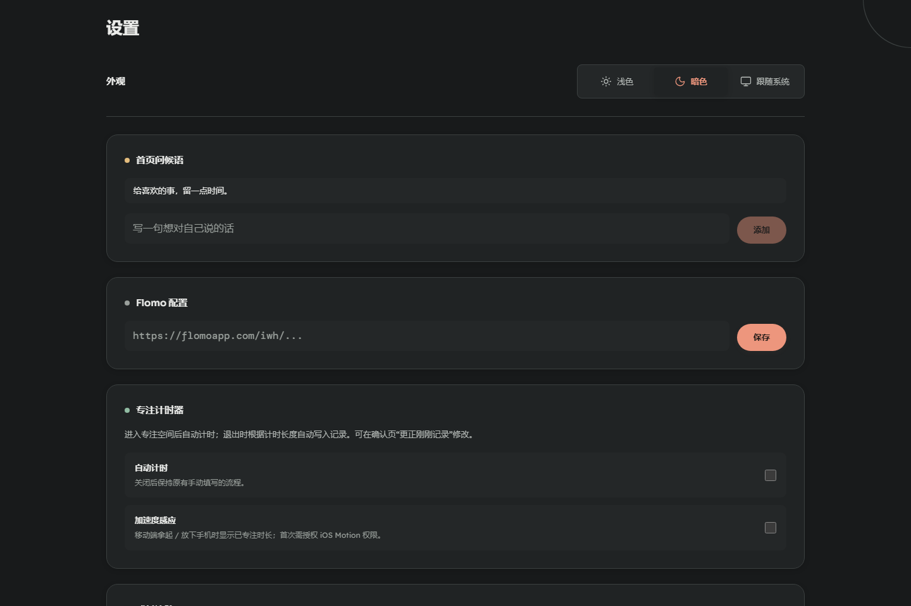

[English](README.md) | [中文](README_zh.md)

# Level Up


A personal growth dashboard. Not a new productivity system — a connector for tools I already use.

I track habits and intentions in a lightweight check-in system, log time in iHour, and write notes in flomo. Each does one thing well. Level Up doesn't replace them. It pulls the data together, adds an immersive environment to work in, and turns scattered effort into something you can see accumulate over time.

> Developed with Claude Code and Codex, from an empty Next.js repo to a multi-user app for focus, daily records, growth feedback, and real-time conversation.

## Screenshots

Current interface, September 7, 2026. Screenshots use demonstration data, not personal records.

| Home: light | Home: dark, navigation open |
|---|---|
|  |  |
| **Focus** | **Appearance settings** |
|  |  |
| **Growth analysis** | **Community** |
|  |  |

## Features

**Home**: A paper-sculpture Hero with custom greetings, a countdown, today's focus metrics, and sticky notes. On a 2560×1440 desktop viewport, the overview, notes, and community entry fit without page scrolling. The notes list scrolls independently; smaller windows retain room for readable content.

**Focus mode**: A fullscreen environment with your own background photos, ambient audio, and a return button. Automatic timing and phone pickup/putdown detection are optional settings. Timed sessions can save automatically on exit; the end panel supports manual hours-and-minutes entry and recoverable drafts. A landscape "desktop clock" layout covers phone-on-stand use. Before entering, the start button uses the available vertical space on larger screens.

**Appearance and navigation**: Choose light, dark, or system appearance in Settings. The choice persists across reloads and syncs between tabs; system mode responds to OS changes. Both themes cover forms, charts, dialogs, and paired transparent Hero artwork. Desktop navigation unfolds from the upper-right corner into a quarter-circle wheel with keyboard support. Mobile navigation stays along the bottom and makes room for the keyboard and device safe areas.

**Analysis** — A growth-feedback surface, not a passive report:
- **Today in review** — a short reading of the day's records, balancing effort, progress, and recovery without treating every count as a score.
- **Growth heatmap** — a 90-day, 6-dimension grid with quantile-based intensity.
- **Focus trends and time allocation** — learning time and leisure shown separately, alongside accumulated records and a history drawer with notes.
- Daily entries persist as drafts for each user and date. Add or correct individual focus sessions with hours-and-minutes input, including records for previous days.

**Community** — Multi-channel chat for the people you invited. Text, images, reply threads. A check-in button posts your daily stats as a card. Real-time sync through Supabase, with admin-managed channels.

**Settings**: Appearance, background images, audio clips, flomo webhook URL, custom homepage greetings, community nickname, and optional tracking for timing, motion, habits, progress, and daily state.

## The return button

Most focus apps measure output. The return button measures something else.

When you notice you've drifted and press it, the count goes up. The goal isn't zero returns — it's the noticing. A session with fifteen returns means you caught yourself fifteen times and chose to come back. That's what attention training actually looks like. Nothing in the analytics treats a higher return count as "worse."

## Design

L-Drift now has a warm light theme and a charcoal dark theme, with coral, sage, honey, and sky accents. Transparent paper artwork gives the homepage its identity; the dark version adds restrained pointer lighting on desktop. Touch devices and reduced-motion settings keep the artwork static.

The original design grew from ten visual explorations.

The early explorations included Inkstone (dark Eastern aesthetic, readability problems), Aurora (warm but flat), Cosmos (sci-fi, felt borrowed), Void and Nebula (early dark-theme studies), Liquid Glass (iOS 26 style, too trend-bound), Spectrum (color-coded dashboard), and Luma (clean but with a generic purple palette).

Two made the shortlist. Atelier: Swiss editorial style, strong countdown hover effects that felt genuinely surprising. Porcelain: wabi-sabi aesthetic, terracotta and sage color system with real sophistication. The final design takes color cues from both — warm parchment base, vermillion and coral accents, sage green, honey yellow. No purple. The system is called L-Drift.

## Development

The project started as a six-day sprint from an empty Next.js repo to a deployed multi-user platform, then kept evolving over the following months.

**The first week**
- **Feb 27** — System design document, Supabase schema, project scaffold.
- **Feb 28** — Ten design explorations in parallel, each as a standalone HTML file. The feedback round: purple disqualified (reads as generic AI aesthetic), warm editorial palette from Atelier and Porcelain kept.
- **Mar 1** — Full rebuild with the L-Drift design system. Focus mode 4-state machine (default → transitioning → immersive → ending). Analysis and settings pages. First deployment.
- **Mar 2** — Mobile adaptation at three breakpoints. Bug fixes: int4 overflow in sticky-note ordering (`Date.now()` in ms exceeds PostgreSQL int4 max), storage bucket name mismatches, home overview reading from the wrong data source. Multi-user auth with invite codes, row-level security on every table.
- **Mar 3** — Community chat. Three new tables (`user_profiles`, `channels`, `messages`), real-time sync, image uploads, reply threads, check-in cards, first-run nickname modal.

**After the sprint**
- **Growth analytics redesign** — reframed the analysis page from a dashboard into a growth-feedback system: the Growth Echo pipeline, the 90-day heatmap, and the growth curve. Backed by a unit-tested metrics layer.
- **Focus flow reliability** — restructured the focus experience around one coordinated state model: timer, accelerometer-based pickup/putdown detection, auto-commit on exit, recoverable end-panel drafts, hours-plus-minutes input, and preloaded dissolve transitions instead of hard background swaps.
- **September 2026 interface update with Codex**: light/dark/system appearance, transparent paper artwork, corner navigation, mobile navigation refinements, clearer growth copy, and viewport-aware home and focus layouts.
- Ongoing UI alignment to the L-Drift language and a growing suite of unit tests for the analytics, draft, timer, and motion-detection logic.

The design decisions weren't AI output — they were proposals evaluated through iteration. The ten HTML prototypes were things to react to, not things to accept. What emerged came from repeated feedback about what read as too safe, what felt borrowed, what the colors were saying.

## Stack

| | |
|---|---|
| Framework | Next.js 16 App Router (static export) |
| Language | TypeScript |
| UI | React 19 |
| Styling | Tailwind CSS v4 + the L-Drift design-token system |
| Database | Supabase (PostgreSQL + Storage + Realtime) |
| Auth | Supabase Auth with invite codes |
| Charts | Recharts |
| Tests | `node:test` (run via `npm test`) |
| Deployment | Cloudflare Pages (static export) |
| Fonts | Sora · Lexend · DM Mono |

## Project layout

```
src/
  app/            Next.js routes: home, focus, analysis, community, settings, auth
  components/     Per-surface UI (home/ focus/ analysis/ community/)
  contexts/       AuthContext, NavContext
  hooks/          theme subscription, local-date updates, and other UI hooks
  lib/
    theme.ts      theme preferences and first-paint initialization
    analysis/     growth metrics, the echo pipeline, the heatmap builder
    api/          Supabase data access, one module per table
    *-timer / *-draft / motion-detector   focus-session logic (unit-tested)
supabase/         migration.sql + setup guide
docs/plans/       design + implementation notes per feature
docs/screenshots/ current README screenshots with demonstration data
```

## Run locally

```bash
npm install
npm run dev        # http://localhost:3000
npm test           # run the unit tests
npm run lint       # ESLint
npm run build      # production static export to ./out
```

You'll need a Supabase project and a `.env.local` (see below) before the app does anything useful.

## Self-host

Fork the repo, set up Supabase, deploy the static export to Cloudflare Pages (or any static host).

**Supabase**

1. Run `supabase/migration.sql` in the SQL Editor. It creates every table, all RLS policies, and the `register_with_invite()` function on a fresh project. It's idempotent — safe to re-run.
2. Create three public storage buckets: `focus-images`, `audio-clips`, `chat-images`.
3. Authentication → Providers → Email → turn **Confirm email** off (registration is gated by invite codes instead).
4. Enable Realtime for the `messages` table (Database → Replication).
5. Insert one or more invite codes into the `invite_codes` table.

The migration creates:
- `invite_codes` — registration control
- `user_profiles` — nicknames and admin flags
- `channels`, `messages` — community chat
- `daily_records`, `sticky_notes`, `focus_sessions`, `focus_images`, `audio_clips`, `countdowns`, `user_growth_preferences` — personal data

Users see only their own personal data (enforced by RLS). Community tables are readable by everyone logged in; only admins can create or delete channels.

**Environment variables** (`.env.local`, and in your host's dashboard):

```env
NEXT_PUBLIC_SUPABASE_URL=
NEXT_PUBLIC_SUPABASE_ANON_KEY=
```

No `DEFAULT_USER_ID` is needed — auth handles user identity.

**Deploy (Cloudflare Pages)**

- Build command: `npm run build`
- Output directory: `out`
- Add the two environment variables above

The app builds as a static export (`output: 'export'`), so it runs on Cloudflare Pages, GitHub Pages, or any static host — all dynamic state lives in Supabase.

**First user**

The first registered user should be the admin. Set `user_profiles.is_admin = true` for that user in the Supabase dashboard. Admins can create and delete channels.

## License

MIT
