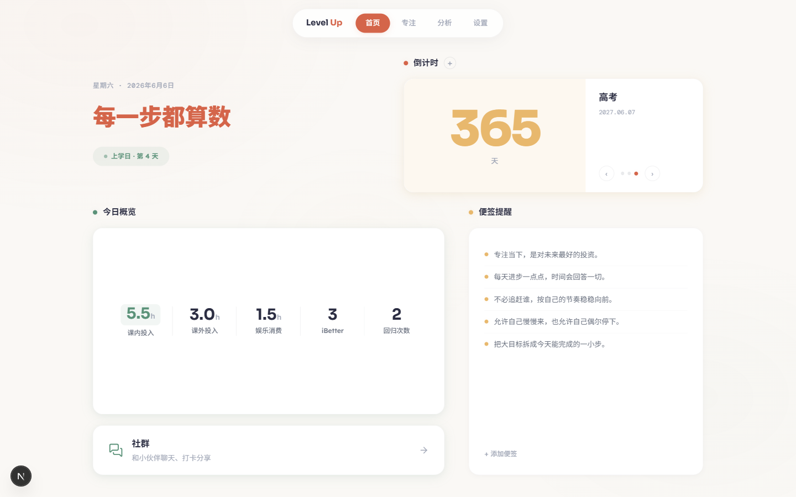
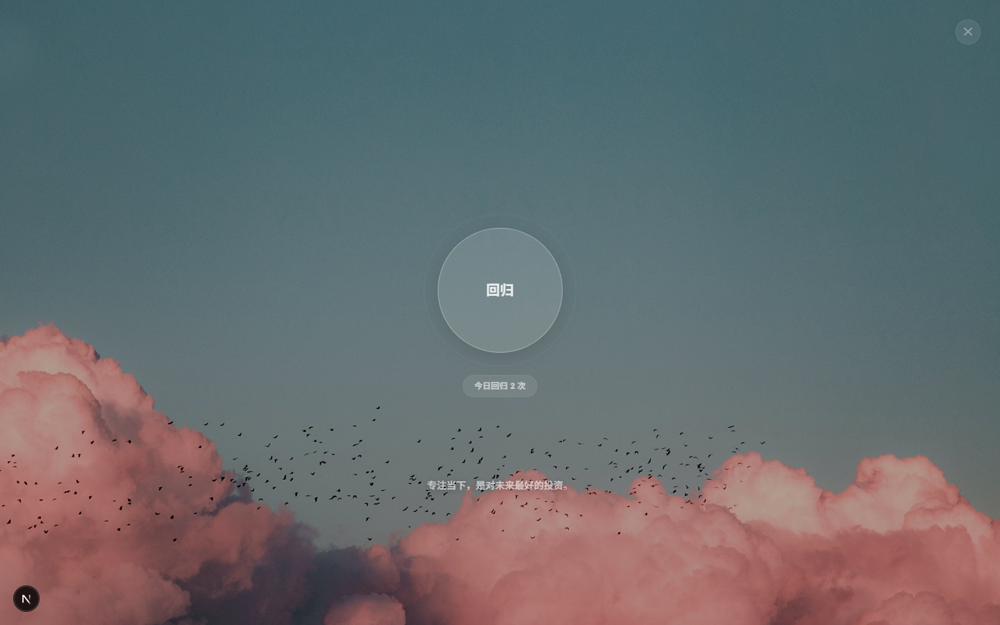
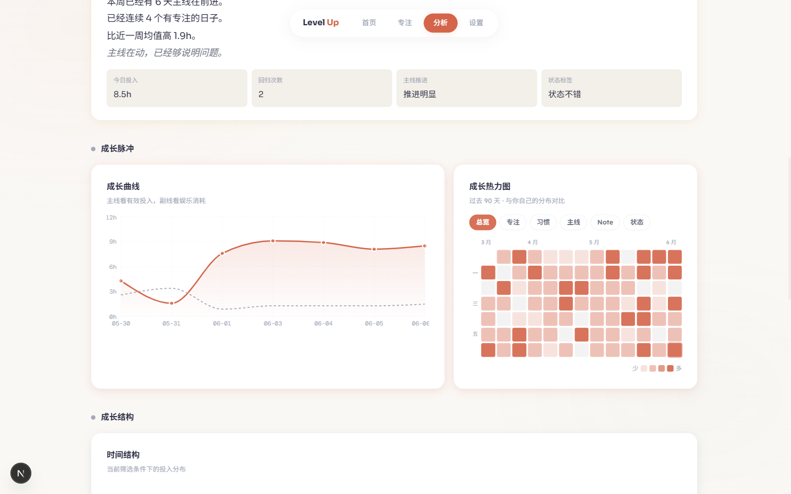
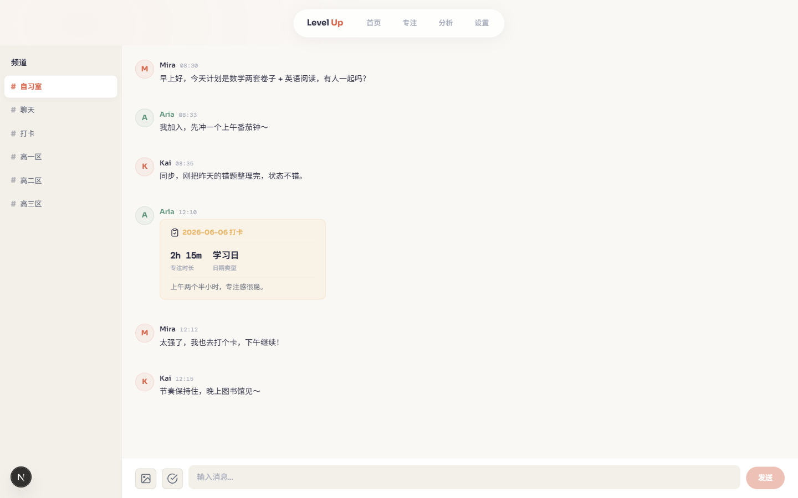

[English](README.md) | [中文](README_zh.md)

# Level Up


A personal growth dashboard. Not a new productivity system — a connector for tools I already use.

I track habits and intentions in a lightweight check-in system, log time in iHour, and write notes in flomo. Each does one thing well. Level Up doesn't replace them. It pulls the data together, adds an immersive environment to work in, and turns scattered effort into something you can see accumulate over time.

> Built end-to-end with Claude Code over roughly three months — from an empty Next.js repo to a multi-user platform with real-time chat, a motion-aware focus timer, and a growth-feedback analytics engine.

## Screenshots

| Home | Focus |
|---|---|
|  |  |
| **Analysis** | **Community** |
|  |  |

## Features

**Home** — A countdown to whatever date you're building toward. Today's focus metrics broken down by category. Sticky notes surfaced at random so they don't get buried.

**Focus mode** — A fullscreen environment with your own photos as background and ambient audio. The central element is a return button. A timer runs the session; on phones, the accelerometer detects when you pick the device up or put it down, so the readout reflects real focus time. Sessions auto-commit when you exit, drafts survive interruptions, and a landscape "desktop clock" layout covers phone-on-stand use.

**Analysis** — A growth-feedback surface, not a passive report:
- **Today Growth Echo** — a natural-language reading of your day, generated by a small four-generator pipeline (snapshot · pattern · position · voice) with a curator that picks what's worth saying.
- **Growth heatmap** — a 90-day, 6-dimension grid with quantile-based intensity.
- **Growth curve** — effective investment over time, with entertainment shown as a soft comparison layer rather than mixed into the main line.
- Daily entry form persisted as a per-(user, date) draft, focus-time pie, trend chart, and a history drawer with notes.

**Community** — Multi-channel chat for the people you invited. Text, images, reply threads. A check-in button posts your daily stats as a card. Real-time sync through Supabase, with admin-managed channels.

**Settings** — Background images, audio clips, Flomo webhook URL, custom homepage greetings, community nickname, and toggles for the optional advanced-tracking fields.

## The return button

Most focus apps measure output. The return button measures something else.

When you notice you've drifted and press it, the count goes up. The goal isn't zero returns — it's the noticing. A session with fifteen returns means you caught yourself fifteen times and chose to come back. That's what attention training actually looks like. Nothing in the analytics treats a higher return count as "worse."

## Design

Ten visual directions before one stuck.

The rejects: Inkstone (dark Eastern aesthetic, readability problems), Aurora (warm but flat), Cosmos (sci-fi, felt borrowed), Void and Nebula (dark mode candidates, parked for later), Liquid Glass (iOS 26 style, too trend-bound), Spectrum (color-coded dashboard), Luma (clean but the purple palette read like every AI product from 2023).

Two made the shortlist. Atelier: Swiss editorial style, strong countdown hover effects that felt genuinely surprising. Porcelain: wabi-sabi aesthetic, terracotta and sage color system with real sophistication. The final design takes color cues from both — warm parchment base, vermillion and coral accents, sage green, honey yellow. No purple. The system is called L-Drift.

## Built with Claude Code

The project started as a six-day sprint from an empty Next.js repo to a deployed multi-user platform, then kept evolving over the following months.

**The first week**
- **Feb 27** — System design document, Supabase schema, project scaffold.
- **Feb 28** — Ten design explorations in parallel, each as a standalone HTML file. The feedback round: purple disqualified (reads as generic AI aesthetic), warm editorial palette from Atelier and Porcelain kept.
- **Mar 1** — Full rebuild with the L-Drift design system. Focus mode 4-state machine (default → transitioning → immersive → ending). Analysis and settings pages. First deployment.
- **Mar 2** — Mobile adaptation at three breakpoints. Bug fixes: int4 overflow in sticky-note ordering (`Date.now()` in ms exceeds PostgreSQL int4 max), storage bucket name mismatches, home overview reading from the wrong data source. Multi-user auth with invite codes, row-level security on every table.
- **Mar 3** — Community chat. Three new tables (`user_profiles`, `channels`, `messages`), real-time sync, image uploads, reply threads, check-in cards, first-run nickname modal.

**After the sprint**
- **Growth analytics redesign** — reframed the analysis page from a dashboard into a growth-feedback system: the Growth Echo pipeline, the 90-day heatmap, and the growth curve. Backed by a unit-tested metrics layer.
- **Focus flow reliability** — restructured the focus experience around one coordinated state model: timer, accelerometer-based pickup/putdown detection, auto-commit on exit, recoverable end-panel drafts, hours-plus-minutes input, and preloaded dissolve transitions instead of hard background swaps.
- Ongoing UI alignment to the L-Drift language and a growing suite of unit tests for the analytics, draft, timer, and motion-detection logic.

The design decisions weren't AI output — they were proposals evaluated through iteration. The ten HTML prototypes were things to react to, not things to accept. What emerged came from repeated feedback about what read as too safe, what felt borrowed, what the colors were saying.

## Stack

| | |
|---|---|
| Framework | Next.js 16 App Router (static export) |
| Language | TypeScript |
| UI | React 19 |
| Styling | Tailwind CSS v4 + the L-Drift design-token system |
| Database | Supabase (PostgreSQL + Storage + Realtime) |
| Auth | Supabase Auth with invite codes |
| Charts | Recharts |
| Tests | `node:test` (run via `npm test`) |
| Deployment | Cloudflare Pages (static export) |
| Fonts | Sora · Lexend · DM Mono |

## Project layout

```
src/
  app/            Next.js routes: home, focus, analysis, community, settings, auth
  components/     Per-surface UI (home/ focus/ analysis/ community/)
  contexts/       AuthContext, NavContext
  lib/
    analysis/     growth metrics, the echo pipeline, the heatmap builder
    api/          Supabase data access, one module per table
    *-timer / *-draft / motion-detector   focus-session logic (unit-tested)
supabase/         migration.sql + setup guide
docs/plans/       design + implementation notes per feature
```

## Run locally

```bash
npm install
npm run dev        # http://localhost:3000
npm test           # run the unit tests
npm run build      # production static export to ./out
```

You'll need a Supabase project and a `.env.local` (see below) before the app does anything useful.

## Self-host

Fork the repo, set up Supabase, deploy the static export to Cloudflare Pages (or any static host).

**Supabase**

1. Run `supabase/migration.sql` in the SQL Editor. It creates every table, all RLS policies, and the `register_with_invite()` function on a fresh project. It's idempotent — safe to re-run.
2. Create three public storage buckets: `focus-images`, `audio-clips`, `chat-images`.
3. Authentication → Providers → Email → turn **Confirm email** off (registration is gated by invite codes instead).
4. Enable Realtime for the `messages` table (Database → Replication).
5. Insert one or more invite codes into the `invite_codes` table.

The migration creates:
- `invite_codes` — registration control
- `user_profiles` — nicknames and admin flags
- `channels`, `messages` — community chat
- `daily_records`, `sticky_notes`, `focus_sessions`, `focus_images`, `audio_clips`, `countdowns`, `user_growth_preferences` — personal data

Users see only their own personal data (enforced by RLS). Community tables are readable by everyone logged in; only admins can create or delete channels.

**Environment variables** (`.env.local`, and in your host's dashboard):

```env
NEXT_PUBLIC_SUPABASE_URL=
NEXT_PUBLIC_SUPABASE_ANON_KEY=
```

No `DEFAULT_USER_ID` is needed — auth handles user identity.

**Deploy (Cloudflare Pages)**

- Build command: `npm run build`
- Output directory: `out`
- Add the two environment variables above

The app builds as a static export (`output: 'export'`), so it runs on Cloudflare Pages, GitHub Pages, or any static host — all dynamic state lives in Supabase.

**First user**

The first registered user should be the admin. Set `user_profiles.is_admin = true` for that user in the Supabase dashboard. Admins can create and delete channels.

## License

MIT
